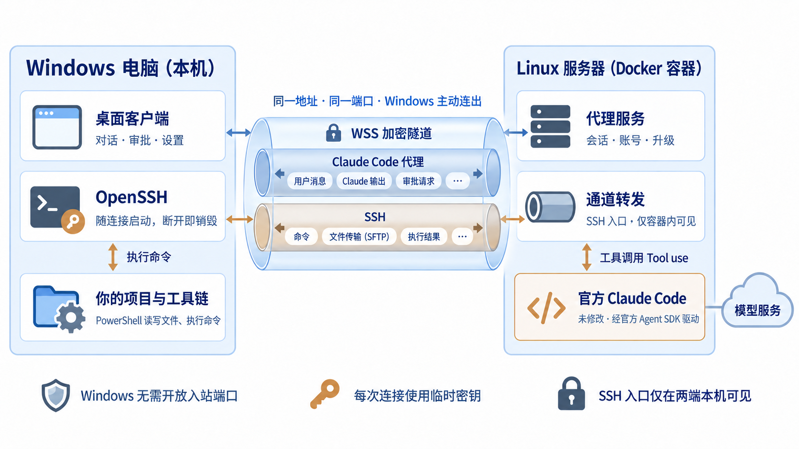

# CC Desk Tunnel（CC 桌面隧道）

**简体中文** | [English](README.en.md)

用桌面客户端驱动云端的 Claude Code，经反向隧道在你的 Windows 本机执行。

Claude Code（简称 CC）运行在一台 Linux 服务器上；项目代码、编译器和各种工具都留在 Windows 本机。CC Desk Tunnel 把两端接起来：服务器上是一个容器，Windows 上是一个桌面客户端，Claude 通过一条加密的反向 SSH 通道在你的电脑上读写文件、执行命令。

[下载](https://github.com/sun168567/cc-desk-tunnel/releases/latest) · [快速开始](#快速开始) · [安全须知](#安全须知) · [文档](#文档) · 许可：[Apache-2.0](LICENSE)

> [!WARNING]
> **本项目主要由 AI 编写**，由个人维护，没有经过专业的安全审计，可能存在尚未发现的缺陷。它会让一台服务器获得在你电脑上执行命令的能力，使用前请读完[安全须知](#安全须知)和[账号须知](#账号须知)，并自行评估风险。
>
> 本项目与 Anthropic 没有隶属或合作关系。“Claude”“Claude Code”是 Anthropic 的商标。

## 解决什么问题

| 常见做法 | 麻烦在哪 | 用 CC Desk Tunnel |
| --- | --- | --- |
| 把项目搬到服务器上，让 Claude Code 在那里开发 | 要在服务器上重装一遍工具链；编译、测试吃配置，得买高配机器；用不了本机的编辑器、模拟器和各种桌面软件 | 项目和工具链留在本机，命令在本机执行；服务器只跑 Claude Code，低配即可 |
| 用远程桌面或 SSH 终端操作服务器上的 CLI | 画面延迟、中文输入和复制粘贴别扭，长输出难以翻阅 | 本机的桌面应用，原生的输入、滚动和复制 |
| 直接使用命令行界面 | 多个项目和会话不好管理，工具调用和思考过程挤在一屏滚动的文字里 | 按项目分组的会话列表，过程折叠成摘要、可逐级展开 |

## 工作方式



- 两台机器之间只有一条 WSS 加密隧道，用同一个地址和端口。里面有两类连接：桌面客户端与代理服务之间的对话（文档里叫控制连接），和 Claude Code 经 SSH 操作本机的执行通道。
- Windows 主动连出，不需要公网 IP，也不需要开放任何入站端口。
- 每次连接临时生成 SSH 密钥，断开即销毁；Windows 上不安装常驻服务。
- 项目只是官方 Agent SDK 与未修改的官方 Claude Code 之上的一层胶水：不改 CLI 本体，不替换它的工具、审批和上下文管理。会话与长期记忆由云端的 Claude Code 自己保存。

本仓库公开客户端、服务端以及构建、部署脚本的全部自有源码，不另设闭源功能。**这不意味着 Claude Code 也被本项目开源**：官方 CLI 与 Agent SDK 由官方渠道安装，仍按 Anthropic 的条款使用；随包的第三方组件各自遵循其许可，详见 [NOTICE](NOTICE)。

## 功能

| | |
| --- | --- |
| **项目与会话** | 按 Windows 文件夹分组；新建、改名、删除、搜索、分叉；从任意一条自己的消息“编辑重发” |
| **对话过程** | 流式回复、思考摘要、工具调用的入参与结果；运行中追加消息、随时停止 |
| **原生控制** | 模型、推理强度、审批模式、上下文占用与主动压缩、Claude Code 常用设置；需要时打开内嵌的原生终端 |
| **账号与用量** | 在客户端里登录 / 退出云端的 Claude 账号，查看额度、重置时间和调用统计 |
| **定时任务** | 到点向指定会话或新会话发送预设提示词，也可以直接让 Claude 帮你设置 |
| **省心** | 托盘后台、记住凭据与自动登录、未发送内容按会话保存 |
| **一键升级** | 服务端跟踪发布页；在客户端里点一下即可升级服务端和客户端，不必登录服务器 |

## 快速开始

需要：一台有公网 IP 或域名的 Linux 服务器（x86_64，推荐 Ubuntu，已安装 Docker），和一台 Windows 10 / 11 x64 电脑。

**服务器不需要高配。** 编译、测试和各种开发工具都在 Windows 本机运行，服务器上只有 Claude Code 和一个轻量的代理服务，2 核 1 GB 内存的入门机型就能运行。只有打算让 Claude 直接在服务器上编译或跑重负载时，才需要按那些任务选配置。

### 1. 部署服务端

在服务器上执行：

```sh
sudo bash -c "$(curl -fsSL https://raw.githubusercontent.com/sun168567/cc-desk-tunnel/main/deploy/install.sh)"
```

脚本会：

1. 检查 Docker、Docker Compose 等依赖。缺少时只告诉你安装命令，不会替你安装系统软件。
2. 从本仓库的发布页下载最新的服务端程序包并校验，解压到 `/opt/cc-desk-tunnel`。
3. 询问公网地址、证书方式、端口和数据目录（都有默认值，一路回车即可），然后构建镜像并启动。
4. 打印客户端要填的**服务地址、证书指纹、服务凭据**，以及需要在防火墙放行的 TCP 端口（默认 8787，只有这一个）。

目前不提供现成镜像，镜像在你的服务器上从源码构建，首次需要几分钟。脚本不会修改防火墙、nginx 或 SSH 配置。再次运行同一条命令可以升级已有部署。手动安装、三种证书方式、备份恢复等见[部署操作手册](deploy/README.md)；已有 nginx 和域名时见[用 nginx 反代](deploy/nginx.md)。

### 2. 安装 Windows 客户端

从[发布页](https://github.com/sun168567/cc-desk-tunnel/releases/latest)下载 `CC-Desk-Tunnel-Setup-<版本>-x64.exe` 并安装。安装包自带 PowerShell 7 和 OpenSSH，不需要另装任何东西。启动后填入上一步的三项信息并连接。

首次运行会遇到 SmartScreen 提示，处理方法见[杀毒软件与 SmartScreen](#杀毒软件与-smartscreen)。

### 3. 登录 Claude

在客户端左下角的账号页登录你的 Claude 账号（走官方 `claude auth` 流程，登录凭据只保存在服务器上），添加一个项目文件夹，开始对话。

## 安全须知

**一个前提：服务器必须是你自己控制、可信的机器。** 连接期间，服务器能以你的 Windows 用户身份执行任意命令。服务器被攻陷，等于你的电脑被攻陷。不要把它部署在与他人共用或来路不明的机器上。

### 端口

| 端口 | 用途 | 是否需要放行 | 靠什么保护 |
| --- | --- | --- | --- |
| 服务端口（默认 8787/TCP） | 客户端登录与对话；Claude 到你电脑的执行通道也由客户端经它建立 | 需要。nginx 模式下改为放行 nginx 的 443，8787 只监听本机 | TLS + 服务凭据 + 登录限速；执行通道另有每次连接随机生成的密钥 |
| 通往 Windows 的 SSH 端口（随机） | Claude 在你的电脑上执行命令 | **不需要，也无法放行** | 只监听容器内部的回环地址，没有发布到服务器，更不会出现在公网；只接受本次连接的临时公钥 |

- **Windows 一侧**不需要放行任何入站端口；本机的 SSH 服务只监听回环地址，随连接启停。
- **如果服务器的防火墙放行了全部端口**：SSH 端口依然无法从外部访问，本项目暴露的仍然只有上面这一个端口，安全性取决于服务凭据。但全部放行会把服务器上的其他服务（例如它自己的 SSH）暴露出去，建议只放行需要的端口。
- 想进一步收紧，可以在云厂商的安全组里只允许你自己的出口 IP 访问这个端口。注意 Docker 发布的端口通常不受 `ufw` 规则限制，来源限制请在云厂商的安全组里做。
- **从 0.2.9 及更早版本升级的部署**原先还放行了隧道端口（默认 7000/TCP）。0.2.10 起不再使用它，可以从防火墙和安全组里去掉。

### 必须知道的四件事

1. **服务凭据等同于完全控制权。** 拿到它的人可以使用你的 Claude 账号，并在你的电脑上执行任意命令。使用脚本自动生成的随机凭据，不要改成短口令，不要截图或贴到聊天、issue 里；泄漏后在服务器上执行 `manage.sh token` 更换。
2. **不是沙箱。** Claude 能访问你的 Windows 用户能访问的一切，而不只是项目目录。项目只靠提示词引导它在项目内工作，审批沿用 Claude Code 自己的机制。
3. **数据会离开本机。** Claude 读取的文件片段和命令输出会经过你的服务器发往模型服务；服务器上保存着会话记录和 Claude 登录凭据，备份文件同样包含这些秘密。
4. **指纹要从可信渠道取得。** 使用自签证书时，证书指纹应当来自你自己登录服务器看到的安装汇总，而不是别人转发的消息。

> 请 AI 助手帮你部署时，也请让它先读这一节，并提醒你完成：只放行一个端口、妥善保存服务凭据、确认服务器可信。

完整的威胁模型、已有的防护和漏洞报告方式见 [SECURITY.md](SECURITY.md)；端口、证书与信任边界的细节见[部署与安全边界](docs/deployment.md)。

## 账号须知

**在 Anthropic 看来，这是什么？** 是一份运行在你服务器上的官方 Claude Code：通过官方流程登录，由官方 Agent SDK 启动，直接从服务器连接模型服务。本项目不修改 Claude Code，不经手也不改写它与模型服务之间的请求，不伪造地区、设备或客户端身份。Claude 在你电脑上执行命令的方式，与你在服务器上用 Claude Code 通过 SSH 操作另一台机器没有区别。

这只是对结构的说明，**不是对账号安全的保证**。请留意：

- **服务器所在地就是你的使用地点。** Claude Code 的全部请求都从服务器发出。请选择位于 [Anthropic 支持的国家和地区](https://www.anthropic.com/supported-countries)、来源正常的服务器。即使你本人身处支持的地区，把服务端放在不支持的地区，或放在被大量滥用过的 IP 上，也可能触发风控而被误判。本项目不会、也不能改变或掩饰这一点。
- **条款由你自己确认。** Anthropic 对订阅登录和 Agent SDK 的使用范围有明确规定（见其[法律与合规说明](https://code.claude.com/docs/en/legal-and-compliance)），其中限制第三方产品提供 Claude.ai 登录或代为使用订阅额度。技术上能用不代表你的用法获得了许可；拿不准时改用 API key（在数据目录的 `config/provider.json` 中配置）。
- **一个账号只给自己用。** 不要用它共享或转售账号；项目不提供、也不接受这类功能。
- 项目不对账号状态、可用性或合规性作任何承诺。

## 杀毒软件与 SmartScreen

- **不再带 frpc。** 0.2.9 及更早的客户端带有内网穿透工具 frp 的 `frpc.exe`，它经常被 Windows Defender 和其他杀毒软件当作“黑客工具 / 风险软件”隔离。0.2.10 起执行通道由客户端自己经服务地址建立，安装包和服务端镜像里都没有 frp 了；升级后旧的 `frpc.exe` 会被安装程序删除。
- **内置组件被拦截时，先核对再放行。** 客户端仍带有官方发布的 OpenSSH 和 PowerShell 7，打包时校验 SHA256，只在连接期间运行，只监听本机。它们被拦截的情况少见；遇到时先确认安装包来自本仓库的[发布页](https://github.com/sun168567/cc-desk-tunnel/releases/latest)，对照 `SHA256SUMS` 校验，并查看具体被拦截的文件。确认来源后，仅对已核验的组件文件设置必要的例外，不建议关闭杀毒软件或排除整个磁盘。文件已被隔离时，可在核验后恢复或重新安装。
- **SmartScreen。** 安装包没有代码签名，首次运行会出现“Windows 已保护你的电脑”，点“更多信息 → 仍要运行”。
- 项目不会修改任何安全软件的设置。不放心可以自己从源码构建。

## 连接失败时

登录页的提示第一行是原因，后面是该检查的地方。连接分两段，可据此判断问题在哪一段：

| 提示 | 含义 | 处理 |
| --- | --- | --- |
| 无法解析域名 / 连接超时 / 拒绝了连接 | 控制连接没有到达服务端 | 核对服务地址与端口，检查服务器是否在线、控制端口是否放行 |
| 证书不受信任 / 指纹不匹配 / 证书已过期 | TLS 校验没有通过 | 自签证书填写安装时给出的 SHA256 指纹；换过证书后用新指纹；过期则在服务器上续期 |
| 服务凭据不正确 | 已连到服务端，凭据被拒绝 | 核对凭据；连续失败多次会被暂时拒绝 |
| 版本不一致 | 客户端与服务端不是同一版本 | 按登录页的提示升级 |
| SSH 服务被拦截 / 找不到 / 没能启动 | 凭据已通过，本机的 `sshd.exe` 或 PowerShell 没能运行 | 见上一节，先看安全软件的保护记录 |
| 执行通道没有就绪 | 凭据已通过，本机 SSH 服务已启动，服务端经执行通道连不回本机 | 提示里带有具体原因时按它处理；经反向代理或系统代理连接时，确认它允许同一地址同时有多条连接 |
| 服务端经隧道连不上本机的 SSH 服务 | 执行通道已建立，探测命令没有应答 | 检查安全软件是否拦截了内置的 `sshd.exe` 或 PowerShell |

## 使用边界

- **单用户自用。** 一个服务对应一个使用者、同一时间一台在线的 Windows 设备。没有多用户、权限分级或租户隔离，也不打算做。
- **不改官方本体，不做对抗。** 不含任何针对风控或检测的规避设计，也不以突破服务的地区限制为目的。

## 文档

| 文档 | 内容 |
| --- | --- |
| [部署操作手册](deploy/README.md) | 安装、升级、三种 TLS 入口、备份恢复、日常运维 |
| [部署与安全边界](docs/deployment.md) | 端口、证书、凭据、数据与信任边界 |
| [安全说明](SECURITY.md) | 威胁模型、已有防护、已知不足、漏洞报告 |
| [架构](docs/architecture.md) | 组成、连接建立过程、关键设计决定 |
| [原生运行与会话存储](docs/native-runtime.md) | 如何驱动官方 CLI、上下文归属、审批、保留期 |
| [Windows 客户端](apps/desktop/README.md) · [Linux 服务](apps/server/README.md) · [消息契约](packages/protocol/README.md) | 各模块的实现说明 |
| [路线与现状](docs/roadmap.md) · [变更记录](CHANGELOG.md) | 已完成、待验证、计划；各版本的变化 |
| [开发约定](docs/development.md) | 分支、提交、检查、发布 |

文档目前只有中文。

## 从源码构建

需要 Git、Node.js 24 与 npm；Windows 上使用 PowerShell 7。

```powershell
npm ci
npm run dev               # 本地模拟服务 + 浏览器界面，不需要任何账号
npm test                  # 单元测试；另有 typecheck、test:ui、check
npm run package:windows   # 生成 Windows 安装包，准备步骤见 apps/desktop/README.md
npm run package:server    # 生成服务端程序包，传到服务器后运行其中的 deploy/install.sh
```

```text
apps/desktop/       Windows 客户端：界面（React）、Electron 主进程、连接桥与本机执行组件
apps/server/        Linux 服务：会话管理、Claude Code 适配、Windows 隧道、调用统计、版本跟踪
packages/protocol/  两端消息契约（Zod）
deploy/             Docker 部署与运维脚本
scripts/            工程检查、开发启动、打包、发布
docs/               跨模块的架构、部署、开发文档
```

开发规范见[开发约定](docs/development.md)。

## 社区

认可 [LINUX DO](https://linux.do/) 社区倡导的真诚、友善、团结与专业，也感谢佬友们关于远程开发和开源工具的讨论。欢迎交流使用体验；反馈问题时请先遮盖账号、服务凭据、服务器地址和项目隐私。安全漏洞请走[私下报告入口](SECURITY.md#报告漏洞)。

## 许可

[Apache License 2.0](LICENSE)。随包分发的第三方组件及其许可见 [NOTICE](NOTICE)。
